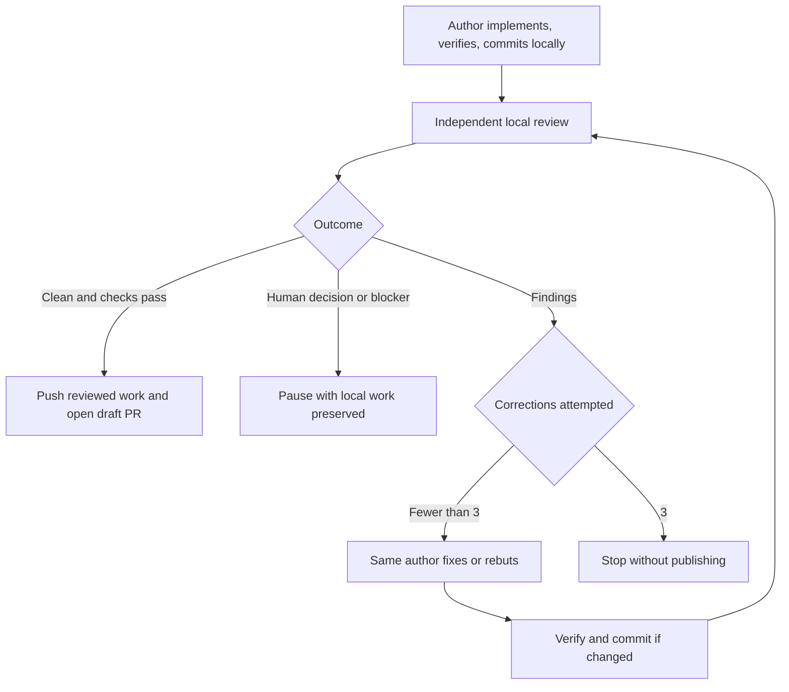

# Tracked Delivery Workflow

Use `plan-issue-tree` to prepare tracked work, `implement-ticket` to implement and review each ticket, and `finalize-parent` to clean up and review the combined parent delivery. The specialist skills own discovery, specification, TDD, and review analysis; these wrappers coordinate branches, handoffs, and delivery.

## Planning

`plan-issue-tree` runs `grill-with-docs`, `to-spec`, and `to-tickets` in sequence, honoring their existing user checkpoints without an extra publication approval.

- Specifications, acceptance criteria, ticket relationships, and planning handoffs live in the tracker.
- Only repository documents produced by `grill-with-docs`, typically ADRs, research notes, and glossary changes, are committed during planning.
- The integration branch and planning worktree are created before discovery. Documents are pushed before tickets are declared ready. If no document changed, the existing pushed tip is the baseline; no artificial artifact or empty commit is needed.

The handoff records:

```text
Implementation base: integration/<parent>
Implementation branch: integration/<parent> for one ticket; a ticket branch for each child
Pull request base: <target branch> for one ticket; integration/<parent> for each child
Closing issue: owner/repository#<implementation-ticket>
Planning baseline: <commit SHA>
Planning artifacts:
- docs/adr/<file>
- docs/research/<file>
```

Use `none` when there are no artifacts. Each child has its native parent relationship, blockers, acceptance criteria, branch fields, and planning baseline. A single implementation issue holds the entire handoff without a child tree; its integration branch is also its implementation branch, and its pull request targets the original target branch.

Before implementing a child, verify that the baseline and artifacts are reachable from its fetched base and completed blockers have landed there. Missing handoffs must be resolved, not replaced with another base.

## Local implementation loop

Start `$implement-ticket <ticket>` in the author conversation. That same agent implements, coordinates reviews, and addresses findings. For a single ticket it reuses the integration branch and planning worktree. For a child ticket it creates the declared ticket branch and worktree under the repository's `.worktrees/` directory. It uses the repository-required isolated test environment in both cases.

At startup, associate the implementation ticket with its intended project and set its project status to In progress, then read back both values. Reuse an existing project item and preserve other memberships. Resolve the project from the request, repository conventions, or an unambiguous ticket/parent association; surface ambiguity instead of selecting an arbitrary project. On resume, finish incomplete setup without resetting a later review/done status.

A separate reviewer checks the exact local commit in a detached worktree. It receives the pinned specification and local reports, not the author's implementation conversation. `/code-review` runs its independent Standards and Spec subagents; the author waits until they finish.



`implement-ticket` coordinates the single-ticket loop. It uses `/implement` for implementation, tests, and local commits. Its independent reviewer supplies the embedded review step; the same author handles corrections within this loop.

The initial review is followed by at most three correction-and-review cycles. Rebuttal-only responses count. Every correction receives independent review, including the third, and only the reviewer closes findings. Interruptions and repeated invocations resume the recorded phase without resetting the budget.

## Local handoff

Review state lives under the common Git directory at `ticket-workflows/<ticket-key>/<run-id>/`. The agent prints this path. The run records its specification snapshot, base and candidate commits, check results, cycle count, phase, findings, responses, and substantive human decisions. These raw coordination files are neither committed nor uploaded. The final pull request description ends with a concise record of the correction-loop count, findings from each completed review pass, and human decisions requested and resolved.

The [local loop contract](skills/implement-ticket/references/local-review-loop.md) defines the precise state and resumption rules. All review agents normally share this local repository. A reviewer on another machine needs an explicit transfer of the unpublished commits and run.

A normal invocation delegates review automatically when the agent environment supports subagents. Resume an interrupted run with `$implement-ticket <local-run-path>`. Without delegation, report that limitation instead of substituting author self-review.

These skills describe an agent-operated workflow with persisted state. They do not install a background daemon or an independent loop-enforcement runtime.

## Publication and stopping

Each delivery skill owns publication for its run. `implement-ticket` requires a complete clean review of the exact current commit/specification, passing checks, a clean author worktree, and reconciled remote publication inputs. It then normally pushes the reviewed history, opens or updates the ticket's draft PR, and verifies its head, base, and provider-native closing association. On GitHub the body uses `Closes #<issue>` (or the cross-repository form). If the native association is missing, add it with `addCloseIssueReferences` and independently verify the exact ticket in `closingIssuesReferences` for every base branch. Text and timeline cross-references alone are insufficient; a missing native link leaves publication incomplete. The PR summarizes the resulting change, validation, cleanup opportunities, and local review record; raw review conversations remain local.

For child tickets, the PR targets the declared integration branch. GitHub ignores closing keywords for this base, so explicitly establish the native relationship. Automatic closure remains deferred to the default branch; the final integration PR must repeat the closing directives and verify native associations for all delivered children. For a single planned implementation ticket, the integration branch is the implementation branch and its PR targets the original target branch. A standalone unplanned ticket may target its declared target branch. Retain the author worktree and run after completion.

The ticket PR and final handoff include cleanup, dead code removal, and debt-reduction opportunities grounded in the code inspected, ranked by expected impact and estimated effort with code evidence and a brief priority rationale. The handoff also includes verified project/status and PR-link metadata. Keep optional recommendations separate from required fixes; `implement-ticket` does not implement or file them automatically. Report when no worthwhile opportunity was found. Publishing these opportunities in the child PR lets parent finalization assess them without local child runs.

## Parent finalization

Run `$finalize-parent <parent-issue>` after the required child changes have landed on the integration branch. It reuses the integration worktree, reads the parent and complete child tree, and verifies actual delivery rather than relying on issue closure or child approvals. It opens or reuses a draft PR from the already-published integration branch to the original target branch before authoring cleanup.

The author re-reads every child PR's cleanup opportunities, review record, relevant discussion, and code. It deduplicates and ranks candidates by impact, cost, confidence, and risk, executes the most promising bounded cleanup, and requests guidance for consequential scope or behavior choices. Older PRs without cleanup sections are assessed from their diffs and current code. Every candidate receives a disposition; no cleanup quota or extra ticket creation is required.

End-to-end tests must cover the integrated delivery's real user or consumer journeys, including interactions between children and important failure paths. Batch cleanup before establishing this coverage, reuse applicable passing integrated-run or CI results, and capture demonstrations during the same runs. After changes, rerun affected scenarios based on runtime, dependency, test, and environment inputs; report-only edits or a new SHA do not trigger a replay. Broad or uncertain impact requires broader testing. Record each reuse decision and original execution SHA; do not automatically repeat the full set at review or publication. Required scenarios without applicable passing evidence prevent finalization.

Produce a self-contained HTML delivery report following KISS and an inverted pyramid. Open with the feature's purpose, audience, and DX/UX outcome, then show a concrete recorded demonstration, explain how the code works and the cleanup decisions, and finish with validation and detailed evidence. Use a simple reading flow, keep material limitations visible, and place commit metadata, test matrices, and long logs toward the end. Distinguish newly executed and reused evidence, with the reason earlier results still apply. Reuse unchanged demonstration assets and validate report edits without replaying the application. Keep the report and evidence with the local run, return a clickable HTML artifact, and use the repository's authorized artifact channel when available. Missing report evidence prevents finalization even when no cleanup was selected.

Final review covers the full parent diff from the target/integration merge base, including all child changes, their interactions, planning documents, cleanup, end-to-end evidence, and the HTML report. It uses the same independent Standards/Spec review and three-correction limit, with its own persisted `parent-finalization` run and budget. The reviewer checks demonstrations, code explanations, and evidence applicability to the current candidate; reviewers share existing results and request additional runs only for concrete gaps or concerns. The parent and child acceptance criteria define the specification; the planning baseline is delivery evidence rather than the review base. Resume with `$finalize-parent <local-run-path>`.

After a clean final review and passing checks, the skill pushes the reviewed commits and updates the existing draft with the delivered scope, cleanup dispositions, validation, and final review record. It verifies native closing associations for the parent and all delivered children, including nested children, plus required PR checks for the published SHA. Missing delivery, unresolved decisions, failed checks, or exhausted correction cycles leave the draft and local run available for resumption. It does not merge the PR or close issues directly.

| Phase | Authorized by invocation | Human attention |
| --- | --- | --- |
| Plan | Discovery-document commits/pushes; specification and ticket publication | Upstream planning checkpoints; ambiguous ownership |
| Implement | Ticket project association and In progress status; local implementation and review loop; final publication and native PR association after convergence | Ambiguous project/status mapping, product decisions, missing handoffs, blockers, nonconvergence after three cycles |
| Finalize parent | Integration draft PR; bounded cleanup; isolated end-to-end testing and HTML demonstration/code report; final review loop and publication after convergence | Missing child delivery, consequential cleanup choices, unresolved decisions, blocked or failed end-to-end checks, nonconvergence after three cycles |
| Review | Independent local inspection and report | Product or architecture decisions |
| Correct findings | Verified fixes, local commit, and response | Product or architecture decisions |

On a decision, verification failure, stale input, or exhausted nonconverging loop, preserve local work and report the unresolved matter. A changed candidate invalidates its previous clean review. An interrupted publication resumes only its missing steps after verifying the remote head. None of these workflows force-push, merge, close issues, or use tracker reviews as a message board.
