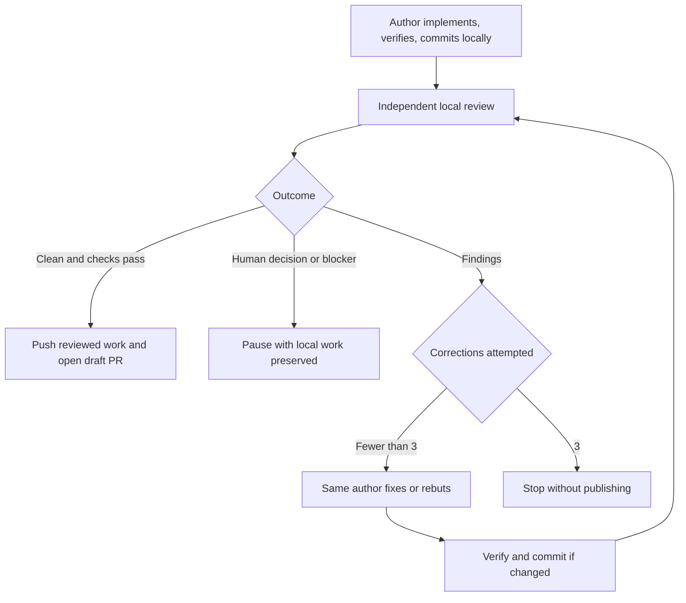

# Tracked Delivery Workflow

Use `plan-issue-tree` to prepare tracked work, then `implement-ticket` to implement, review locally, and publish the finished result. The specialist skills own discovery, specification, TDD, and review analysis; these wrappers coordinate branches, handoffs, and delivery.

## Planning

`plan-issue-tree` runs `grill-with-docs`, `to-spec`, and `to-tickets` in sequence, honoring their existing user checkpoints without an extra publication approval.

- Specifications, acceptance criteria, ticket relationships, and planning handoffs live in the tracker.
- Only repository documents produced by `grill-with-docs`, typically ADRs, research notes, and glossary changes, are committed during planning.
- The integration branch and planning worktree are created before discovery. Documents are pushed before tickets are declared ready. If no document changed, the existing pushed tip is the baseline; no artificial artifact or empty commit is needed.

The handoff records:

```text
Implementation base: integration/<parent>
Implementation branch: integration/<parent> for one ticket; a ticket branch for each child
Pull request base: <target branch> for one ticket; integration/<parent> for each child
Closing issue: owner/repository#<implementation-ticket>
Planning baseline: <commit SHA>
Planning artifacts:
- docs/adr/<file>
- docs/research/<file>
```

Use `none` when there are no artifacts. Each child has its native parent relationship, blockers, acceptance criteria, branch fields, and planning baseline. A single implementation issue holds the entire handoff without a child tree; its integration branch is also its implementation branch, and its pull request targets the original target branch.

Before implementing a child, verify that the baseline and artifacts are reachable from its fetched base and completed blockers have landed there. Missing handoffs must be resolved, not replaced with another base.

## Local implementation loop

Start `$implement-ticket <ticket>` in the author conversation. That same agent implements, coordinates reviews, and addresses findings. For a single ticket it reuses the integration branch and planning worktree. For a child ticket it creates the declared ticket branch and worktree under the repository's `.worktrees/` directory. It uses the repository-required isolated test environment in both cases.

At startup, associate the implementation ticket with its intended project and set its project status to In progress, then read back both values. Reuse an existing project item and preserve other memberships. Resolve the project from the request, repository conventions, or an unambiguous ticket/parent association; surface ambiguity instead of selecting an arbitrary project. On resume, finish incomplete setup without resetting a later review/done status.

A separate reviewer checks the exact local commit in a detached worktree. It receives the pinned specification and local reports, not the author's implementation conversation. `/code-review` runs its independent Standards and Spec subagents; the author waits until they finish.



`implement-ticket` is the only entry point and loop coordinator. It uses `/implement` for implementation, tests, and local commits. Its independent reviewer supplies the embedded review step; the same author handles corrections within this loop.

The initial review is followed by at most three correction-and-review cycles. Rebuttal-only responses count. Every correction receives independent review, including the third, and only the reviewer closes findings. Interruptions and repeated invocations resume the recorded phase without resetting the budget.

## Local handoff

Review state lives under the common Git directory at `ticket-workflows/<ticket-key>/<run-id>/`. The agent prints this path. The run records its specification snapshot, base and candidate commits, check results, cycle count, phase, findings, responses, and substantive human decisions. These raw coordination files are neither committed nor uploaded. The final pull request description ends with a concise record of the correction-loop count, findings from each completed review pass, and human decisions requested and resolved.

The [local loop contract](skills/implement-ticket/references/local-review-loop.md) defines the precise state and resumption rules. All review agents normally share this local repository. A reviewer on another machine needs an explicit transfer of the unpublished commits and run.

A normal invocation delegates review automatically when the agent environment supports subagents. Resume an interrupted run with `$implement-ticket <local-run-path>`. Without delegation, report that limitation instead of substituting author self-review.

These skills describe an agent-operated workflow with persisted state. They do not install a background daemon or an independent loop-enforcement runtime.

## Publication and stopping

Only `implement-ticket` publishes. It requires a complete clean review of the exact current commit/specification, passing checks, a clean author worktree, and reconciled remote publication inputs. It then normally pushes the reviewed history, opens or updates the ticket's draft PR, and verifies its head, base, and provider-native closing association. On GitHub the body uses `Closes #<issue>` (or the cross-repository form). If the native association is missing, add it with `addCloseIssueReferences` and independently verify the exact ticket in `closingIssuesReferences` for every base branch. Text and timeline cross-references alone are insufficient; a missing native link leaves publication incomplete. The PR summarizes the resulting change, validation, and local review record; raw review conversations remain local.

For child tickets, the PR targets the declared integration branch. GitHub ignores closing keywords for this base, so explicitly establish the native relationship. Automatic closure remains deferred to the default branch; the final integration PR must repeat the closing directives and verify native associations for all delivered children. For a single planned implementation ticket, the integration branch is the implementation branch and its PR targets the original target branch. A standalone unplanned ticket may target its declared target branch. Retain the author worktree and run after completion.

The final handoff includes verified project/status and PR-link metadata plus cleanup, dead code removal, and debt-reduction opportunities grounded in the code inspected. Rank these by expected impact and estimated effort, with code evidence and a brief priority rationale. Keep optional recommendations separate from required fixes and do not implement or file them automatically. Report when no worthwhile opportunity was found.

| Phase | Authorized by invocation | Human attention |
| --- | --- | --- |
| Plan | Discovery-document commits/pushes; specification and ticket publication | Upstream planning checkpoints; ambiguous ownership |
| Implement | Ticket project association and In progress status; local implementation and review loop; final publication and native PR association after convergence | Ambiguous project/status mapping, product decisions, missing handoffs, blockers, nonconvergence after three cycles |
| Review | Independent local inspection and report | Product or architecture decisions |
| Correct findings | Verified fixes, local commit, and response | Product or architecture decisions |

On a decision, verification failure, stale input, or exhausted nonconverging loop, preserve local work and report the unresolved matter. A changed candidate invalidates its previous clean review. An interrupted publication resumes only its missing steps after verifying the remote head. None of these workflows force-push, merge, close issues, or use tracker reviews as a message board.
